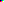
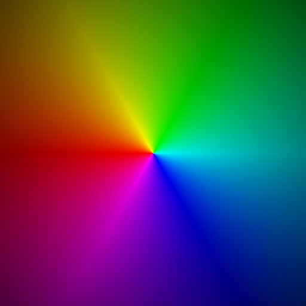

# images
###### i guess this is like a demo of it?

## pbm
```
P1
2 2
0 1
1 0
```
it's really small, because it's 4 pixels...  


## pgm
```
P2
4 2
255
  0  32  64  96
128 160 192 232
```
it's still small  


## ppm
```
P3
4 2
255
  0   0   0   0   0 255   0 255   0   0 255 255
255   0   0 255   0 255 255 255   0 255 255 255
```
it's exactly the same size as the above.  


## color wheel
this was generated with rust code, as with the rest of these.  
[](big.ppm)